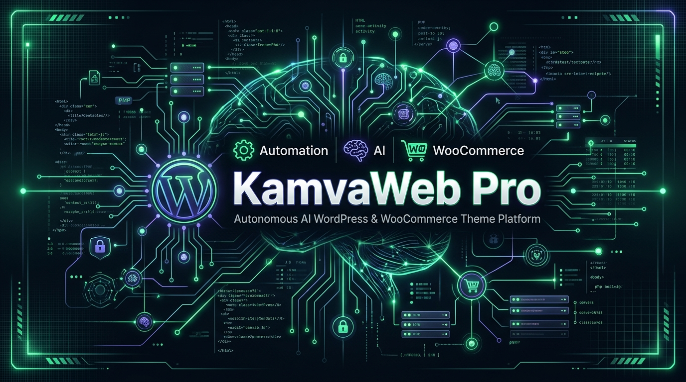

# 🚀 KamvaWeb Pro - Autonomous AI WordPress & WooCommerce Theme Platform

<div align="center">



  <h1>قالب و پلتفرم هوشمند کامواوب پرو - نسل جدید تم‌های خودکار وردپرس و ووکامرس</h1>

  <p>
    <b>پلتفرم سازمانی لایه ۷ وردپرس مجهز به ۱۲ موتور هوش مصنوعی محلی و ابری، کنسول بصری WP-CLI، سیستم مهار ترافیک و بهینه‌ساز نرخ تبدیل (CRO)</b>
  </p>

  <p>
    <a href="https://wordpress.org"></a>
    <a href="https://php.net"></a>
    <a href="https://reactjs.org"></a>
    <a href="https://vitejs.dev"></a>
    <a href="https://ai.google.dev"></a>
    <a href="https://github.com"></a>
  </p>

</div>

---

## 📋 فهرست مطالب (Table of Contents)

1. [معرفی کلی پروژه (Overview)](#-معرفی-کلی-پروژه-overview)
2. [معماری سیستم و معماری ۲ لایه‌ای (Architecture)](#-معماری-سیستم-architecture)
3. [قابلیت‌ها و ماژول‌های اصلی (Core Feature Modules)](#-قابلیت‌ها-و-ماژول‌های-اصلی-core-feature-modules)
   - [۱. کلید قطع اضطراری هوش مصنوعی (GlobalSafetyProtocol)](#۱-کلید-قطع-اضطراری-هوش-مصنوعی-globalsafetyprotocol)
   - [۲. تحلیل‌گر فورنزیک ترافیک زنده (NexusRealtimeTrafficMonitor)](#۲-تحلیل‌گر-فورنزیک-ترافیک-زنده-nexusrealtimetrafficmonitor)
   - [۳. مقیاس‌پذیر پیش‌بینانه منابع سرور (PredictiveResourceScaler)](#۳-مقیاس‌پذیر-پیش‌بینانه-منابع-سرور-predictiveresourcescaler)
   - [۴. هسته پردازش عصبی محلی سرور (KamvaLocalNeuralHub)](#۴-هسته-پردازش-عصبی-محلی-سرور-kamvalocalneuralhub)
   - [۵. بهینه‌ساز صفحات فرود و تست A/B (AiLandingPageOptimizer)](#۵-بهینه‌ساز-صفحات-فرود-و-تست-ab-ailandingpageoptimizer)
   - [۶. دیزاین سیستم و توکن‌های CSS (AiDesignSystemManager)](#۶-دیزاین-سیستم-و-توکن‌های-css-aidesignsystemmanager)
   - [۷. اجراکننده بصری کنسول WP-CLI (KamvaWPCLIRunner)](#۷-اجراکننده-بصری-کنسول-wp-cli-kamvawpclirunner)
   - [۸. اسکنر امنیت و سازگاری افزونه‌ها (AiPluginCompatibilityScanner)](#۸-اسکنر-امنیت-و-سازگاری-افزونه‌ها-aiplugincompatibilityscanner)
   - [۹. تزریق‌کننده اسکیما و Rich Results (AutomatedSchemaGenerator)](#۹-تزریق‌کننده-اسکیما-و-rich-results-automatedschemagenerator)
   - [۱۰. چت آنلاین هوشمند و ساخت پایگاه دانش (AiSalesWidgetLiveDemo)](#۱۰-چت-آنلاین-هوشمند-و-ساخت-پایگاه-دانش-aisaleswidgetlivedemo)
   - [۱۱. داشبورد سلامت و نقشه حرارتی Core Web Vitals](#۱۱-داشبورد-سلامت-و-نقشه-حرارتی-core-web-vitals)
   - [۱۲. مدیر قالب فرزند و کدهای نیتیو PHP 8.2+](#۱۲-مدیر-قالب-فرزند-و-کدهای-نیتیو-php-82)
4. [راهنمای نصب و راه اندازی (Installation & Setup)](#-راهنمای-نصب-و-راه-اندازی-installation--setup)
5. [ممیزی امنیتی و ایمن‌سازی SSRF](#-ممیزی-امنیتی-و-ایمن‌سازی-ssrf)
6. [لایسنس و توسعه‌دهنده (License & Author)](#-لایسنس-و-توسعه‌دهنده)

---

## 🌟 معرفی کلی پروژه (Overview)

**KamvaWeb Pro** یک پلتفرم پیشرفته و فوق‌حرفه‌ای قالب وردپرس و ووکامرس است که با تلفیق **React 18**، **Vite**، **Express Node.js** و **PHP 8.2+** طراحی شده است. این سیستم به وب‌سایت‌های وردپرسی اجازه می‌دهد بدون نیاز به افزونه‌های سنگین جانبی، از قابلیت‌های هوش مصنوعی زنده، مانیتورینگ فورنزیک لایه ۷، کش فوق‌سریع رم (Redis)، مدیریت توکن‌های دیزاین سیستم و اتوماسیون کامل سئو بهره‌مند شوند.

---

## 📐 معماری سیستم (Architecture)

```
                       ┌─────────────────────────────────────────┐
                       │       React 18 + Vite SPA Frontend      │
                       │    (Lucide Icons + Tailwind CSS v4)     │
                       └────────────────────┬────────────────────┘
                                            │ HTTP / JSON API
                                            ▼
                       ┌─────────────────────────────────────────┐
                       │     Express Node.js Middleware Proxy    │
                       │     (Port 3000 / SSRF Security Guard)   │
                       └──────────┬───────────────────┬──────────┘
                                  │                   │
         ┌────────────────────────┴─┐       ┌─────────┴────────────────────────┐
         │ 100% Local Server Engines│       │ External Cloud AI Infrastructure │
         │ (KamvaLocalNeuralHub)    │       │ (Google Gemini 2.5 Flash / Pro)  │
         │ - Int8 ONNX Inferencing  │       │ - Complex Copywriting            │
         │ - NaiveBayes Spam Engine │       │ - Deep Code Analysis & Audit     │
         │ - FastText Categorizer   │       │ - Annual SEO Content Strategy    │
         └──────────────────────────┘       └──────────────────────────────────┘
                                  │
                                  ▼
                       ┌─────────────────────────────────────────┐
                       │    WordPress & WooCommerce PHP Core     │
                       │  - theme-tokens.css Persistence         │
                       │  - WordPress Customizer API Binding     │
                       │  - functions.php & wp_head Hooks        │
                       └─────────────────────────────────────────┘
```

---

## 🛠️ قابلیت‌ها و ماژول‌های اصلی (Core Feature Modules)

### ۱. کلید قطع اضطراری هوش مصنوعی (`GlobalSafetyProtocol`)
- **مکانیزم Kill-Switch آنلاین**: امکان توقف آنی کلیه فرآیندها و کرون‌جاب‌های هوش مصنوعی با یک کلیک جهت مهار آنومالی‌ها.
- **قرنطینه اضطراری (Emergency Lockdown)**: غیرفعال‌سازی هم‌زمان تمامی زیرسیستم‌ها همراه با ثبت دلیل توقف، نام مدیر مجری و مهر زمانی.
- **Audit Trail زنده**: جدول جامع ثبت سوابق تغییرات وضعیت ایمنی و فعالیت‌های مدیران.

---

### ۲. تحلیل‌گر فورنزیک ترافیک زنده (`NexusRealtimeTrafficMonitor`)
- **استخراج کامل هدرهای HTTP**: نمایش تمام کلید/مقدارهای هدر درخواست‌های مسدودشده.
- **مشاهده قطعه‌کد پی‌لود مخرب (Payload Snippet)**: امکان تحلیل کدهای تزریق‌شده (SQLi, XSS, RCE, LFI) با هایلایت نحو و دکمه کپی فوری.
- **جزئیات قانون امنیتی (Security Rule Triggered)**: نمایش کد قانون فایروال AIOS، توضیحات خطای امنیتی و سطح ریسک (Risk Score).

---

### ۳. مقیاس‌پذیر پیش‌بینانه منابع سرور (`PredictiveResourceScaler`)
- **تحلیل پیش‌بینانه الگوی ترافیک**: آنالیز داده‌های تاریخی جهت پیش‌بینی پیک‌های ترافیکی قبل از شروع کمپین‌های فروش.
- **ارتقای خودکار منابع سرور**: پیشنهاد و اعمال یک‌کلیکه تخصیص RAM حافظه PHP (`WP_MEMORY_LIMIT`)، حافظه کش ردیس (`Redis maxmemory`) و تعداد کانکشن‌های دیتابیس در `wp-config.php`.

---

### ۴. هسته پردازش عصبی محلی سرور (`KamvaLocalNeuralHub`)
- **پردازش ۱۰۰٪ آفلاین بدون اینترنت**: اجرای مدل‌های سبک INT8 ONNX و FastText روی RAM سرور بدون وابستگی به APIهای ابری خارجی.
- **سرعت فوق‌العاده (< 2ms Latency)**: تشخیص نیت خرید، فیلتر لایو اسپم نظرات، تحلیل احساسات VADER و دسته‌بندی خودکار کالاها با سرعت ۵۵۰ درخواست بر ثانیه.

---

### ۵. بهینه‌ساز صفحات فرود و تست A/B (`AiLandingPageOptimizer`)
- **تحلیل ترافیک زنده و CRO**: دریافت آنالیز هوشمند نقاط ریزش (Dropoff Sections)، نرخ پرش و سهم کاربران موبایل.
- **تولید خودکار نسخه‌های A/B**: تولید نسخه B با بازنویسی تیترها، تایمر فوریت شمارش معکوس و دکمه‌های CTA ترغیب‌کننده.
- **پیش‌نمایش بصری مقایسه‌ای**: مشاهده هم‌زمان نسخه A و B در ویوپورت‌های دسکتاپ، تبلت و موبایل.

---

### ۶. دیزاین سیستم و توکن‌های CSS (`AiDesignSystemManager`)
- **استخراج فایل مستقل `theme-tokens.css`**: کامپایل توکن‌های رنگ، فونت، فاصله‌گذاری و انحناها در متغیرهای CSS `:root` با ماندگاری کامل در تعویض قالب فرزند.
- **اتصال مستقیم به WordPress Customizer API**: تولید کدهای نیتیو PHP برای ثبت توکن‌ها در بخش سفارشی‌سازی وردپرس.

---

### ۷. اجراکننده بصری کنسول WP-CLI (`KamvaWPCLIRunner`)
- **واسط کاربری ترمینال زنده**: اجرای مستقیم دستورات `wp db optimize`, `wp cache flush`, `wp core verify-checksums`, `wp transient delete` و `wp cron event run`.
- **دستیار هوشمند WP-CLI**: تبدیل سوالات فارسی به دستورات دقیق خط فرمان وردپرس.

---

### ۸. اسکنر امنیت و سازگاری افزونه‌ها (`AiPluginCompatibilityScanner`)
- **تحلیل کدهای PHP 8.2+**: شناسایی توابع منسوخ‌شده، آسیب‌پذیری‌های امنیتی (SQLi, XSS, RCE) و تداخل هوک‌ها.
- **مسدودسازی خودکار افزونه‌های ناامن**: جلوگیری از اجرای افزونه‌های با ریسک critical تا زمان برطرف شدن خطاها.

---

### ۹. تزریق‌کننده اسکیما و Rich Results (`AutomatedSchemaGenerator`)
- **تولید اسکیماهای استاندارد JSON-LD**: استخراج و تزریق هوشمند اسکیماهای Product, Recipe, FAQPage و Article.
- **خروجی کد نیتیو PHP**: تولید توابع اماده `add_action('wp_head')` جهت جایگذاری در فایل `functions.php`.

---

### ۱۰. چت آنلاین هوشمند و ساخت پایگاه دانش (`AiSalesWidgetLiveDemo`)
- **استخراج هوشمند دانش از گفتگوها**: تبدیل خودکار سوالات متداول مشتریان به آیتم‌های ساختاریافته در پایگاه دانش.
- **تحلیل زنده رفتار و نیت خریدار**: محاسبه نمره نیت خرید (Purchase Intent Score) و دسته‌بندی هوشمند لیدها.

---

### ۱۱. داشبورد سلامت و نقشه حرارتی Core Web Vitals
- **نقشه حرارتی گلوگاه‌ها (CoreWebVitalsHeatmap)**: نگاشت اثر عملکردی تک‌تک افزونه‌ها روی LCP, INP, CLS و TTFB.
- **حالت شبیه‌سازی حذف افزونه‌ها**: مشاهده لحظه‌ای میزان صرفه‌جویی در زمان LCP و حجم جاوااسکریپت.

---

### ۱۲. مدیر قالب فرزند و کدهای نیتیو PHP 8.2+
- **کدنویسی ۱۰۰٪ نیتیو وردپرس**: تولید کدهای ایمن وردپرس با توابع `sanitize_text_field`, `esc_attr` و `$wpdb->prepare()`.

---

## ⚡ راهنمای نصب و راه اندازی (Installation & Setup)

### پیش‌نیازها:
- Node.js version 18.0 یا بالاتر
- npm version 9.0 یا بالاتر
- PHP 8.2+ و وردپرس 6.5+

### مراحل نصب:

```bash
# ۱. کلون کردن مخزن گیت‌هاب
git clone https://github.com/your-username/kamvaweb-pro-theme.git

# ۲. ورود به دایرکتوری پروژه
cd kamvaweb-pro-theme

# ۳. نصب وابستگی‌های پلتفرم
npm install

# ۴. اجرای سرور توسعه (Dev Server)
npm run dev

# ۵. بیلد نهایی جهت استقرار روی پروداکشن
npm run build
```

---

## 🛡️ ممیزی امنیتی و ایمن‌سازی SSRF

کلیه درخواست‌های خزشگر (`/api/crawler/crawl-url`) و سرویس‌های بک‌اند به مکانیزم **SSRF Protection** مجهز هستند تا از دسترسی به IPهای شبکه داخلی (`localhost`, `127.0.0.1`, `10.x.x.x`, `192.168.x.x`) جلوگیری نمایند. همچنین تمام ورودی‌های کاربران با توابع ایمن‌سازی وردپرس ضدعفونی می‌شوند.

---

## 📄 لایسنس و توسعه‌دهنده

طراحی و توسعه‌یافته توسط تیم مهندسی **KamvaWeb Pro**.
تمامی حقوق محفوظ است. قابل استفاده تجاری روی پروژه‌های وردپرس و ووکامرس.
